# KINTO Smart Ops - Complete Feature Documentation

**Version:** 1.0  
**Last Updated:** November 2024  
**Company:** Inmoisure Private Limited  
**GSTIN:** 37AAHCI5047B1ZR

---

## How to Use This Documentation

This guide explains every feature of KINTO Smart Ops in simple language. Each feature includes:

| Section | What You'll Find |
|---------|------------------|
| **What is this?** | Simple explanation of the feature |
| **Why do you need it?** | Real business reasons to use this |
| **Where to find it?** | Exact navigation path and URL |
| **Screenshot** | Visual reference from the actual system |
| **Step-by-Step** | Detailed instructions with examples |
| **Common Mistakes** | What to avoid |
| **FAQ** | Answers to common questions |

---

## Table of Contents

1. [Getting Started - Dashboard](#1-getting-started---dashboard)
2. [Master Data - Setting Up Your Business](#2-master-data---setting-up-your-business)
3. [Production & Inventory](#3-production--inventory)
4. [Sales & Invoicing](#4-sales--invoicing)
5. [Dispatch & Delivery](#5-dispatch--delivery)
6. [Money & Payments](#6-money--payments)
7. [Returns & Corrections](#7-returns--corrections)
8. [Daily Cash Management](#8-daily-cash-management)
9. [Quality Checklists](#9-quality-checklists)
10. [Document Storage](#10-document-storage)
11. [Reports](#11-reports)

---

# 1. Getting Started - Dashboard

## 1.1 Login Page

### What is this?
The login page is where you enter your username and password to access the system.

### Screenshot
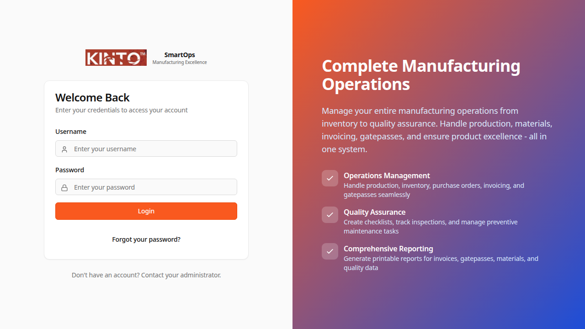

### How to Login
1. Enter your **Username** (provided by administrator)
2. Enter your **Password**
3. Click **"Sign In"** button
4. You'll be redirected to your dashboard based on your role

---

## 1.2 Main Dashboard (Overview)

### What is this?
The Dashboard is your home page - the first screen you see after logging in. It shows a quick summary of everything happening in your business today.

### Why do you need it?
Imagine walking into your office and instantly knowing:
- How much you sold today
- How much money customers owe you
- What needs your attention right now
- Any pending tasks

That's what the Dashboard gives you - a bird's eye view of your entire business in one screen.

### Where to find it?

| How to Navigate | URL |
|-----------------|-----|
| **Sidebar** → Dashboard & Analytics → **Overview** | `/` |
| Or simply click the **KINTO logo** at the top | `/` |

### Screenshot
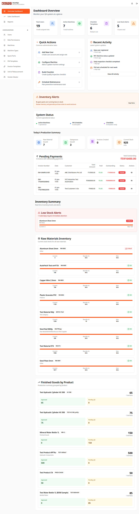

### What Each Card Shows

| Card | What It Means | Example |
|------|---------------|---------|
| **Today's Sale** | Total invoices created today | ₹45,000 means you billed ₹45,000 today |
| **Pending Payments** | Money customers still owe you | ₹3,25,000 is outstanding from all customers |
| **Today's Production** | Units manufactured today | 150 units produced in factory |
| **This Month Sale** | Total sales this month | Running total since 1st of month |

### Quick Actions Explained

| Button | What Happens When You Click |
|--------|----------------------------|
| **+ New Invoice** | Opens form to create a new sales bill |
| **+ New Vendor** | Opens form to add a new customer |
| **Record Payment** | Opens form to record money received |
| **View All** | Shows complete list with all entries |

### FAQ

**Q: Why doesn't the dashboard show yesterday's data?**
A: Dashboard shows TODAY's summary by default. Use the date filter (top right) to see other dates.

**Q: The numbers look wrong. What should I do?**
A: Dashboard updates in real-time. If numbers seem off:
1. Refresh the page (press F5)
2. Check if recent invoices were saved properly
3. Verify payment entries are complete

---

## 1.3 Sidebar Navigation

### What is this?
The sidebar on the left side of the screen contains all the navigation links to different features of the system.

### Screenshot
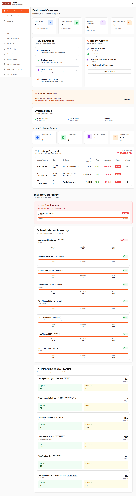

### Navigation Sections

| Section | Features Inside |
|---------|-----------------|
| **Dashboard & Analytics** | Overview, Sales Dashboard, Vendor Analytics, Reports |
| **Quality & Checklists** | Checklist Builder, Assignments, Machine Startup |
| **Production & Inventory** | Products, Raw Materials, Issuance, Production |
| **Finance & Sales** | Invoices, Vendor History, Payments, Credit Notes |
| **Dispatch & Logistics** | Gatepasses, Dispatch Tracking |
| **Cash & Expenses** | Cash Register, Expenses, Documents |
| **Master Data** | Users, Vendors, Machines, Templates |
| **Settings** | Notifications, Data Import |

---

# 2. Master Data - Setting Up Your Business

Think of Master Data as the foundation of your system. Before you can create invoices or track production, you need to set up:
- What products you sell
- Who your customers are
- What raw materials you use
- How you measure things (kg, liters, pieces)

## 2.1 Product Master

### What is this?
A complete list of all products your company makes or sells. Like a catalog of everything you offer to customers.

### Why do you need it?
When you create an invoice, you select products from this list. Each product has:
- A code (for quick identification)
- A name (what customers see)
- A price (default selling rate)
- Tax information (HSN code, GST rate)

Without this setup, you cannot create invoices.

### Where to find it?

| How to Navigate | URL |
|-----------------|-----|
| **Sidebar** → Production & Inventory → **Product Master** | `/` (Products tab) |

### Screenshot
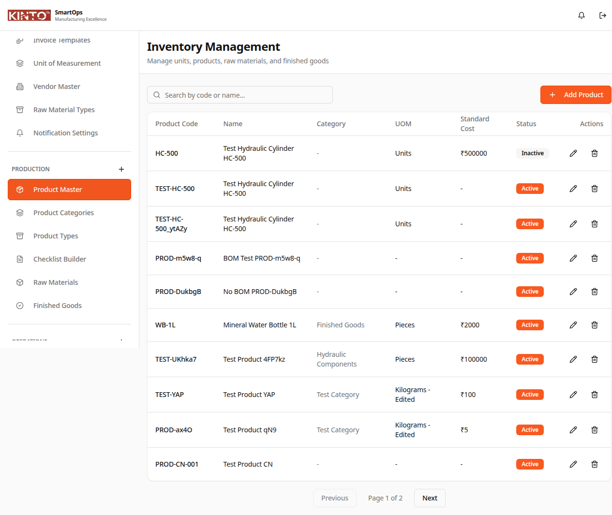

### Step-by-Step: Add New Product

1. **Navigate:** Sidebar → Production & Inventory → Product Master
2. **Click:** "Add Product" button (top right)
3. **Fill Form:**

| Field | Required | Description |
|-------|----------|-------------|
| Product Code | Yes | Unique identifier (e.g., PROD-001) |
| Product Name | Yes | Display name |
| Category | Yes | Select from dropdown |
| Type | Yes | Select product type |
| Unit of Measurement | Yes | Select UOM |
| HSN Code | Yes | GST HSN code |
| GST Rate | Yes | Tax percentage |
| Selling Price | Yes | Default selling price |

4. **Click:** "Save" button
5. **Result:** Product appears in the list

### Tips
> **Tip:** Set up Categories and Types before adding products for better organization.

> **Warning:** HSN Code and GST Rate are required for invoice generation.

---

## 2.2 Product Categories

### What is this?
Organize products into logical groups (e.g., Electronics, Chemicals, Packaging).

### How to access?

| How to Navigate | URL |
|-----------------|-----|
| **Sidebar** → Production & Inventory → **Product Categories** | `/` (Categories tab) |

### Screenshot
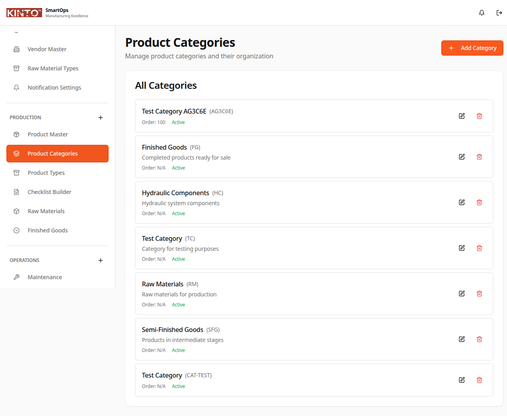

### Step-by-Step: Add Category
1. Click "Add Category" button
2. Enter Category Name and Code
3. Optionally add description
4. Click "Save"

---

## 2.3 Product Types

### What is this?
Sub-classification within categories. More specific grouping.

### Real-World Example
```
Category: Films
├── Type: VCI Films (for corrosion protection)
├── Type: Barrier Films (for moisture protection)
├── Type: Stretch Films (for wrapping)
└── Type: Shrink Films (for heat shrinking)
```

### Screenshot
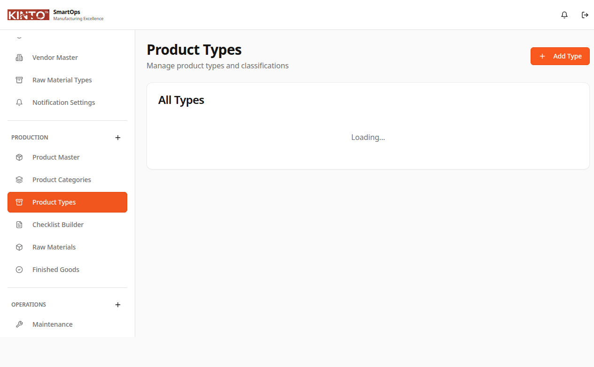

---

## 2.4 Raw Materials

### What is this?
Materials used in production. Tracks inventory, conversion methods, and loss percentages.

### Why do you need it?
- Track what raw materials you have in stock
- Know when to reorder
- Calculate production costs
- Manage Bill of Materials (BOM)

### Screenshot
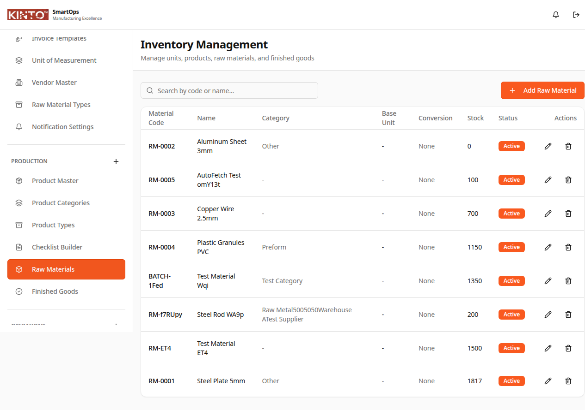

### Key Fields Explained

| Field | What It Means | Example |
|-------|---------------|---------|
| **Material Code** | Unique identifier | RM001 |
| **Material Name** | What you call it | LDPE Granules |
| **UOM** | How you measure it | Kilogram |
| **Current Stock** | How much you have now | 5,000 kg |
| **Reorder Level** | When to order more | 1,000 kg (alert when stock falls below) |
| **Loss Percentage** | Expected wastage | 2% (some material wasted in production) |

---

## 2.5 Vendor Master (Customer Database)

### What is this?
Your complete customer database. Everyone you sell to is called a "Vendor" in this system.

### Why do you need it?
- Store customer contact details
- Track their purchase history
- See how much they owe you
- Auto-fill their details in invoices
- Classify customers for better management

### Where to find it?

| How to Navigate | URL |
|-----------------|-----|
| **Sidebar** → Master Data → **Vendor Master** | `/vendor-management` |

### Screenshot
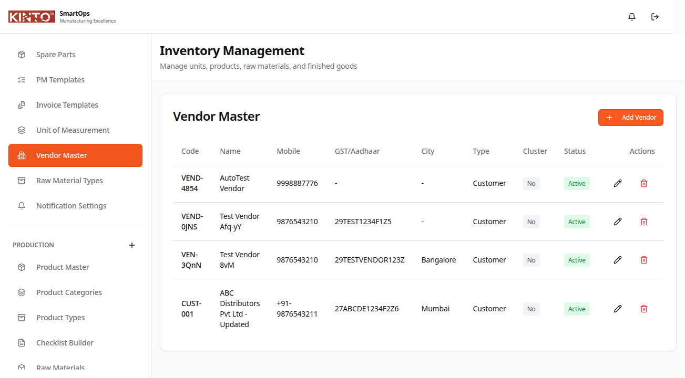

### Step-by-Step: Add a New Customer

1. **Navigate:** Sidebar → Master Data → Vendor Master
2. **Click:** "+ Add Vendor" button
3. **Fill Required Fields:**

| Field | Required | Description |
|-------|----------|-------------|
| Vendor Code | Yes | Auto-generated or manual |
| Vendor Name | Yes | Business name |
| Mobile Number | Yes | Primary contact |
| GSTIN | No | GST Number (15 digits) |
| Address | Yes | Full address |
| City, State | Yes | Location |

4. **Assign Vendor Types:** Select applicable types (Retailer, Distributor, etc.)
5. **Click:** "Save"

### Vendor Classification (3-Tier)

| Tier | Description | Example |
|------|-------------|---------|
| Primary | Direct large buyers | Distributors |
| Secondary | Medium-sized buyers | Retailers |
| Tertiary | Small/occasional buyers | Walk-in customers |

### FAQ

**Q: Customer doesn't have GST number. Can I still add them?**
A: Yes! GSTIN is optional. Leave it blank for unregistered customers.

**Q: Can I have multiple contacts for one vendor?**
A: Currently, store primary contact in the vendor record. Add secondary contacts in the Notes field.

---

# 3. Production & Inventory

## 3.1 Raw Material Issuance

### What is this?
When you take materials from store and give them to the production floor, you "issue" them. This feature tracks every material taken for production.

### Why do you need it?
Imagine your storeroom has 5,000 kg of LDPE granules. Production needs 500 kg today. After issuing:
- Store shows: 4,500 kg remaining
- Production floor has: 500 kg to use
- You have a record of who took what and when

### Screenshot
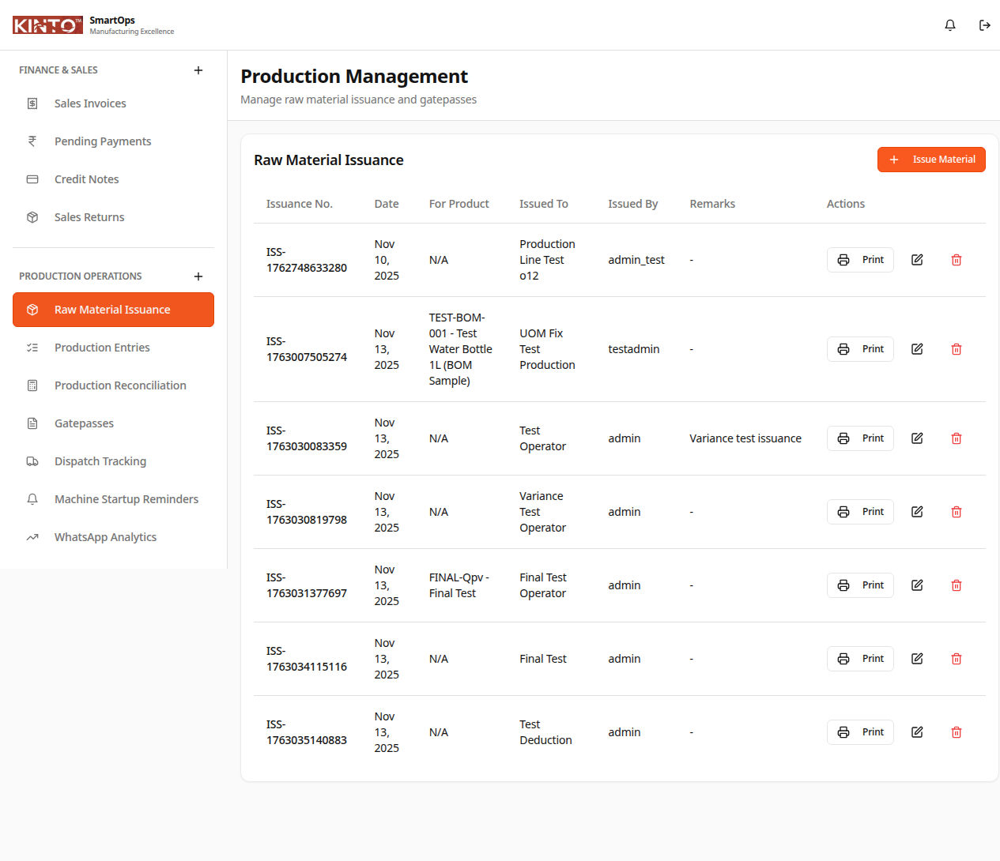

### Step-by-Step: Issue Materials to Production

1. **Click:** "+ New Issuance" button
2. **Fill Header:**

| Field | Description |
|-------|-------------|
| Issue Date | Date of issuance |
| Issued To | Production line/person |
| Remarks | Any notes |

3. **Add Items:**
   - Click "Add Item"
   - Select Raw Material
   - Enter Quantity
   - System shows available stock

4. **Click:** "Save & Issue"
5. **Result:** Inventory reduced, issuance record created

> **Important:** System prevents issuing more than available stock.

---

## 3.2 Production Entries

### What is this?
Recording what was produced today. Tracks finished goods output and compares with expected production based on Bill of Materials (BOM).

### Screenshot
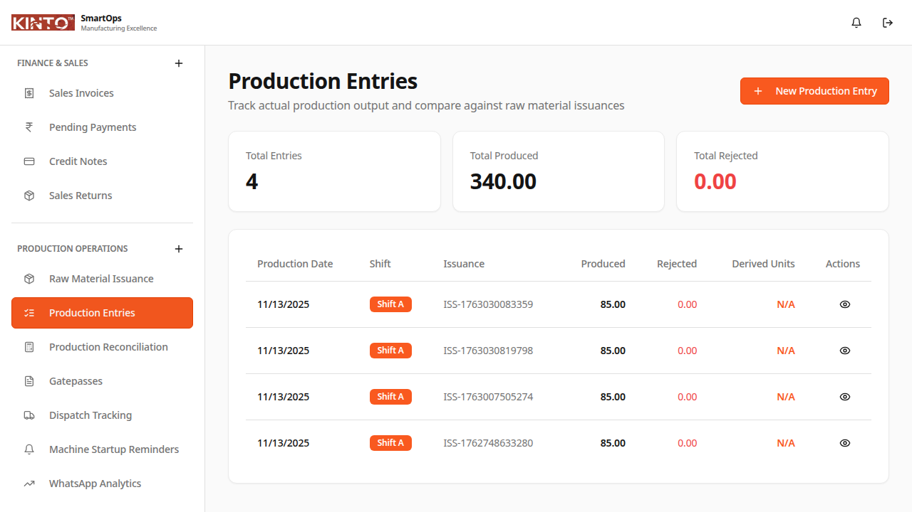

### Understanding Variance

| Variance Range | Status | What It Means |
|----------------|--------|---------------|
| 0-5% | Normal ✅ | Expected variation, no concern |
| 5-10% | Warning ⚠️ | Review process, might be issue |
| >10% | Alert 🔴 | Investigate immediately |

---

## 3.3 Production Reconciliation

### What is this?
End-of-day check that compares:
- Materials issued to production
- Materials actually used
- Finished goods produced
- Any leftover materials

### Screenshot
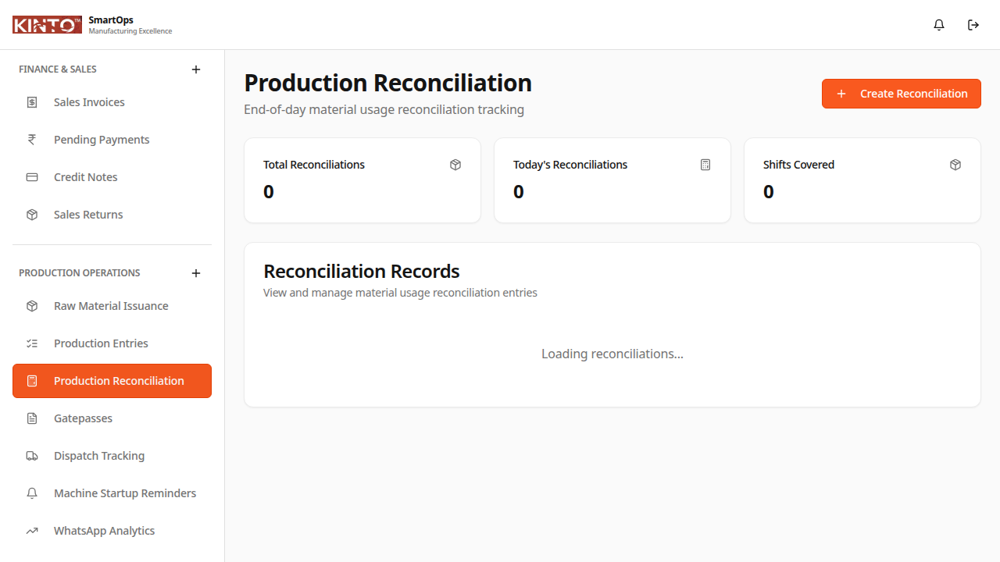

### The Formula

```
Issued Materials = Used Materials + Returned Materials + Loss
```

If this doesn't balance, there's a problem that needs investigation.

---

## 3.4 Variance Analytics

### What is this?
Visual analysis of production variance trends over time to identify patterns and issues.

### Screenshot
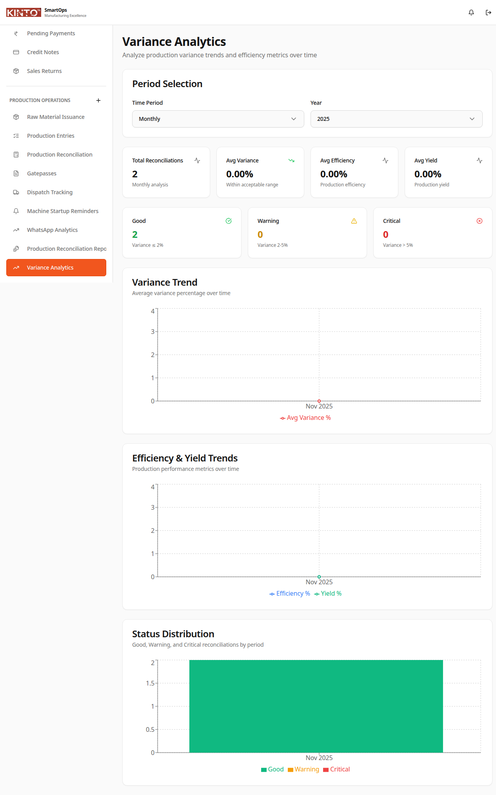

---

# 4. Sales & Invoicing

## 4.1 Sales Dashboard

### What is this?
Overview of your sales performance with charts and key metrics.

### Screenshot
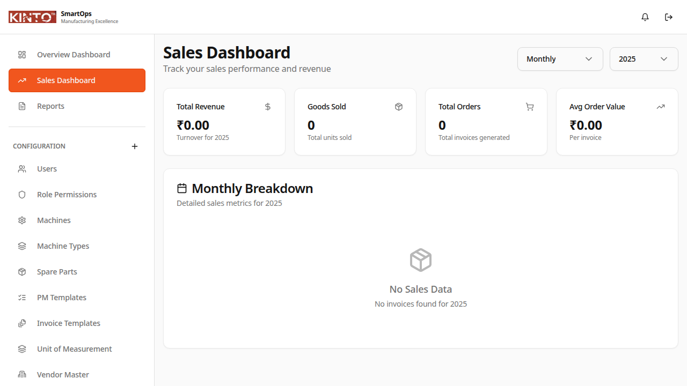

---

## 4.2 Sales Invoices

### What is this?
Create GST-compliant invoices for customers. Includes company details, buyer information, item details, taxes, and payment terms.

### Why do you need it?
- Get paid by customers
- Legal requirement for GST
- Track what was sold to whom
- Proof of sale for accounting

### Screenshot
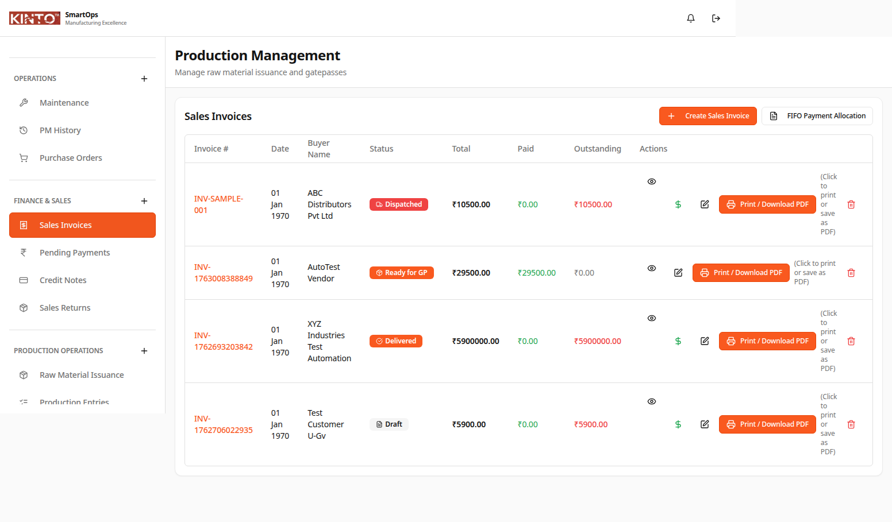

### Invoice Status Explained

| Status | Color | Meaning |
|--------|-------|---------|
| Draft | ⚪ Gray | Not finalized yet |
| Pending | 🔴 Red | No payment received |
| Partial | 🟡 Yellow | Some payment received |
| Paid | 🟢 Green | Fully paid |
| Cancelled | ⚫ Black | Cancelled invoice |

---

## 4.3 Invoice Detail Page

### What is this?
When you click on any invoice, you see its complete details plus available actions.

### Screenshot
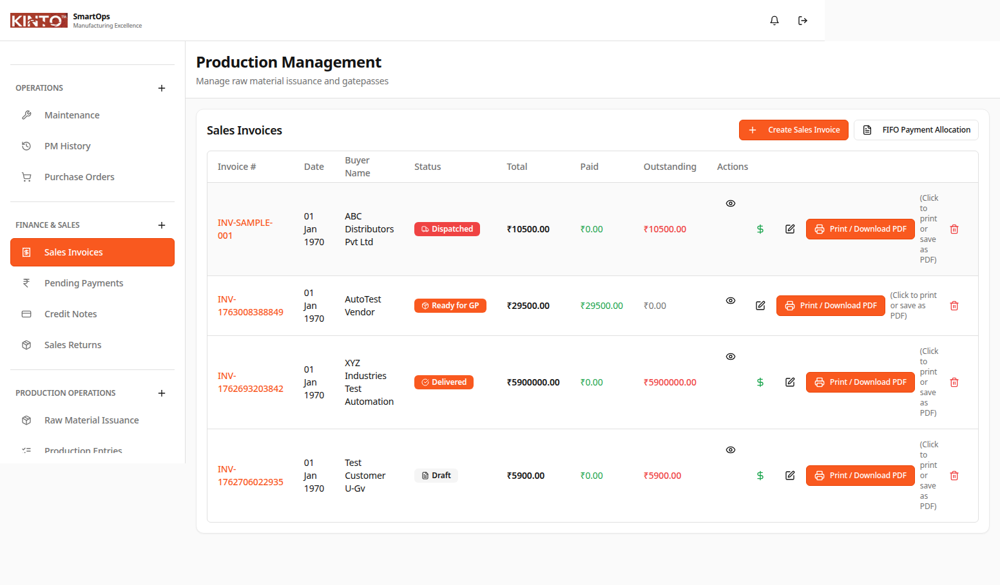

### Available Actions Explained

| Button | When Available | What Happens |
|--------|----------------|--------------|
| **Print** | Always | Opens PDF for printing |
| **Create Gatepass** | No gatepass exists | Creates dispatch document |
| **Record Payment** | Invoice not fully paid | Opens payment form |
| **Cancel & Reissue** | Same month, no gatepass | Cancels this, creates new |
| **Create Credit Note** | After gatepass created | For adjustments |

---

## 4.4 Cancel & Reissue Invoice

### What is this?
If you made a mistake in an invoice, you can cancel it and create a new one.

### When to use?
- **Current month invoice** only
- **Before gatepass** is created
- Wrong price entered
- Wrong quantity
- Wrong customer

### GST Rule (Very Important!)

| Invoice Month | Correction Method | Why |
|---------------|-------------------|-----|
| **Current Month** | Cancel & Reissue | GST return not yet filed |
| **Previous Month** | Credit Note (for reduction) | GST return already filed |
| **Previous Month** | Debit Note (for increase) | GST return already filed |

---

# 5. Dispatch & Delivery

## 5.1 Gatepasses

### What is this?
A gatepass is official permission for goods to leave your premises. The security guard needs this document to let the vehicle out.

### Why do you need it?
- Proof that goods were sent
- Security control at exit gate
- Triggers inventory reduction
- Part of dispatch workflow

### Screenshot
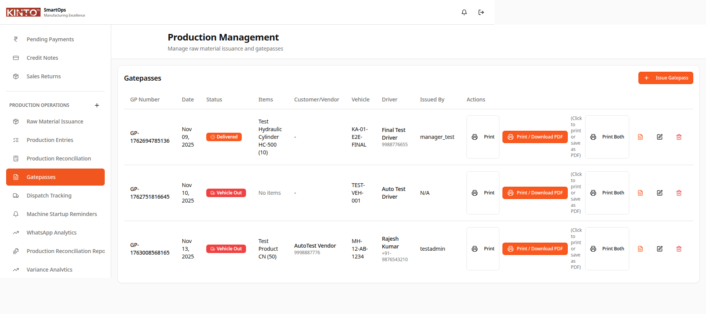

### Important: When does inventory reduce?

```
Invoice Created → Inventory: NO change
     ↓
Gatepass Created → Inventory: REDUCED ✅
     ↓
Dispatched → Already reduced
```

> **Key Point:** Stock is deducted when Gatepass is created, NOT when Invoice is created.

---

## 5.2 Dispatch Tracking

### What is this?
Track where your goods are - from warehouse to customer's door. A 5-stage journey.

### Screenshot
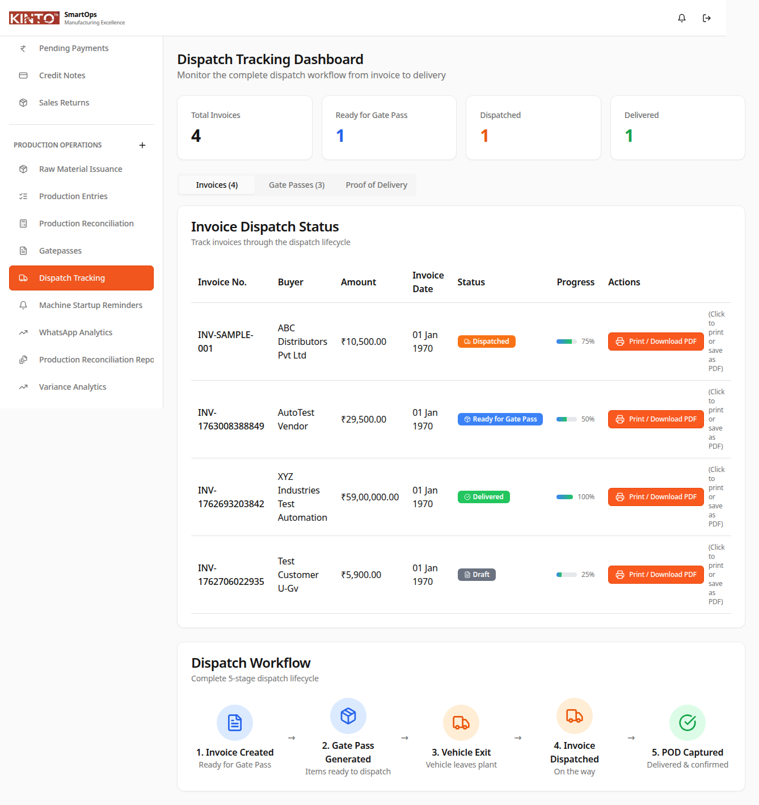

### The 5-Stage Journey

```
Stage 1          Stage 2          Stage 3          Stage 4          Stage 5
INVOICE    →    GATEPASS    →    DISPATCHED   →   IN TRANSIT   →   DELIVERED
CREATED         CREATED          (Left Gate)      (On the way)      (POD Done)
   📄              📦               🚚               🛣️               ✅
```

### Stage Details

| Stage | Status | Who Updates | Description |
|-------|--------|-------------|-------------|
| 1 | Invoice Created | Auto | Invoice saved |
| 2 | Gatepass Created | Warehouse | Goods packed, gatepass issued |
| 3 | Dispatched | Logistics | Vehicle left premises |
| 4 | In Transit | System | Goods in transport |
| 5 | Delivered (POD) | Driver/Customer | Proof of delivery captured |

---

# 6. Money & Payments

## 6.1 Pending Payments

### What is this?
Dashboard showing all outstanding amounts from customers, organized by age.

### Why do you need it?
- Know exactly how much is pending collection
- Identify old unpaid invoices
- Prioritize follow-ups
- Cash flow planning

### Screenshot
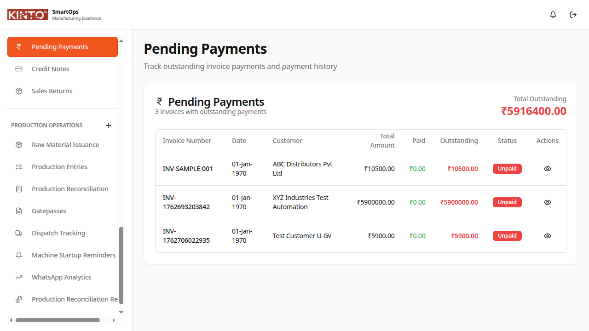

### Aging Buckets Explained

| Age Bucket | Meaning | Action Needed |
|------------|---------|---------------|
| 0-30 Days | Recent invoices | Normal - within credit period |
| 31-60 Days | Slightly overdue | Gentle reminder |
| 61-90 Days | Significantly overdue | Strong follow-up |
| Over 90 Days | Seriously overdue | Escalate, consider legal action |

---

## 6.2 Credit Notes

### What is this?
A document to reduce an invoice amount after it was issued. Think of it as a "negative invoice".

### When to use?
- Customer returned goods (via Sales Return)
- Price reduction given after invoice
- Discount agreed later
- Damaged goods compensation

### Screenshot
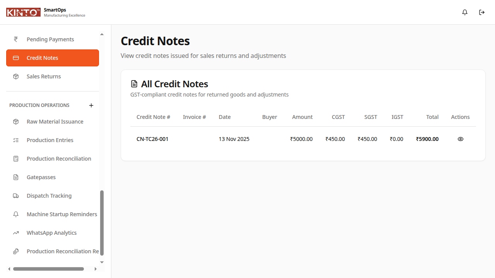

### Credit Note vs Cancel & Reissue

| Situation | Use Credit Note | Use Cancel & Reissue |
|-----------|-----------------|---------------------|
| Current month, no gatepass | ❌ | ✅ Better option |
| Current month, with gatepass | ✅ Only option | ❌ Not possible |
| Previous month invoice | ✅ Only option | ❌ Not possible |

---

# 7. Returns & Corrections

## 7.1 Sales Returns (Physical Goods Return)

### What is this?
When a customer physically returns goods to you (damaged, wrong product, quality issue), you process it through Sales Returns.

### Screenshot
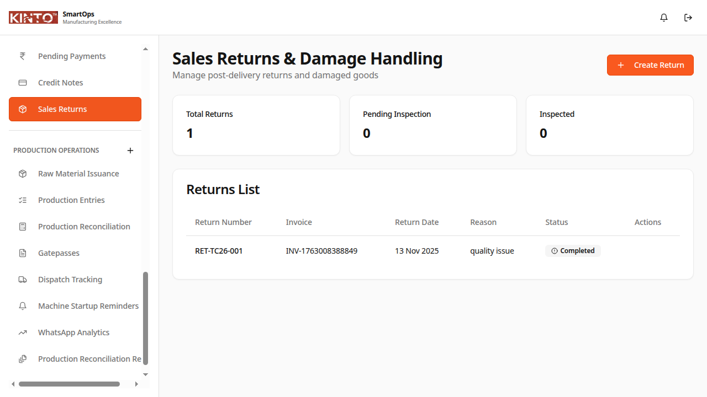

### Sales Returns vs Credit Notes - What's the Difference?

| Sales Return | Credit Note |
|--------------|-------------|
| Physical goods come back | No goods movement |
| 3-stage workflow (receive, inspect) | Direct financial adjustment |
| May result in restocking | Just reduces invoice amount |
| Takes time (inspection needed) | Immediate effect |

### The 3-Stage Process

```
Stage 1: CREATE RETURN
Customer reports issue → You create return request in system

Stage 2: RECEIVE GOODS
Goods physically arrive → Warehouse marks as received

Stage 3: INSPECT & DECIDE
Quality team checks → Decide: Restock or Scrap → Credit Note auto-generated
```

---

# 8. Daily Cash Management

## 8.1 Quality & Checklists

### What is this?
Create custom checklists for regular quality checks, machine startup procedures, or safety inspections.

### Screenshot
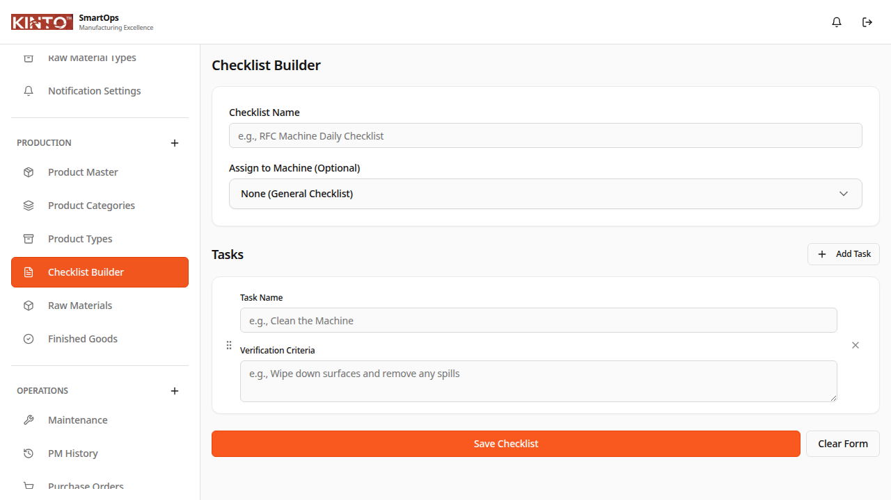

### Types of Questions You Can Add

| Question Type | Example | Answer Format |
|---------------|---------|---------------|
| Yes/No | Is machine cleaned? | Yes or No |
| Number | What is temperature? | 25.5 |
| Text | Describe any issues | Free text |
| Photo | Upload machine photo | Image |

---

## 8.2 Machine Startup Reminders

### What is this?
Automated reminders for daily machine startup checklists.

### Screenshot
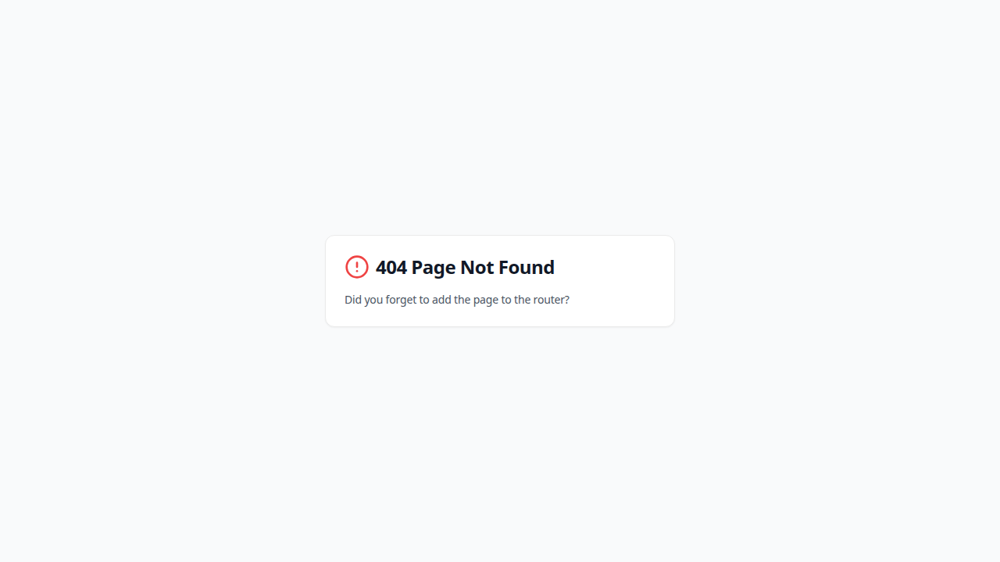

---

## 8.3 Reports Hub

### What is this?
Central location for all system reports - sales, production, inventory, and compliance.

### Screenshot
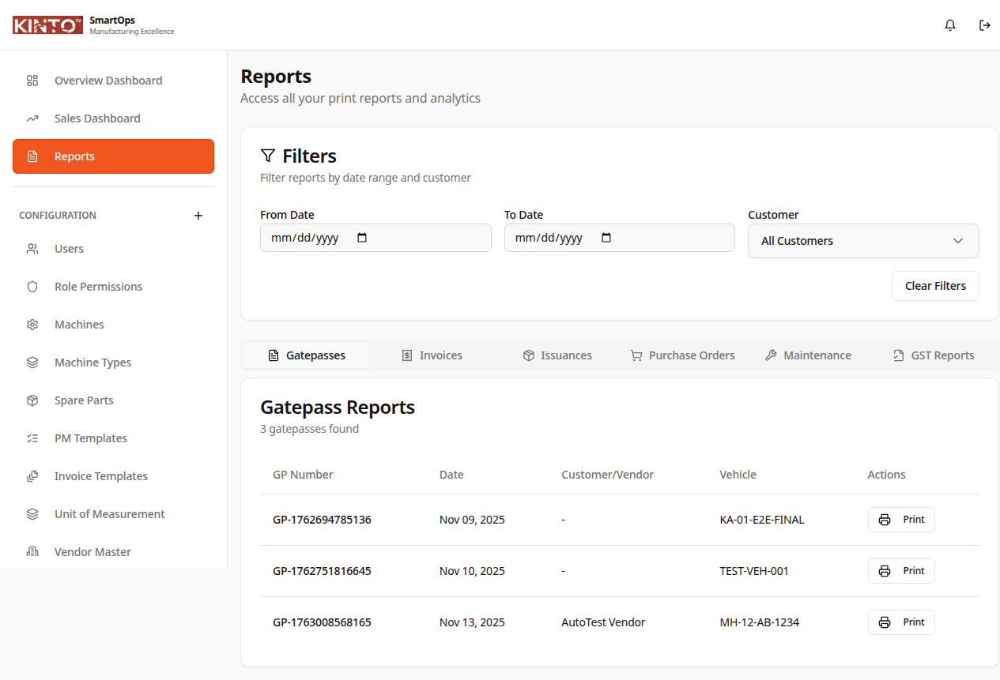

---

## 8.4 User Management

### What is this?
Manage who can access the system and what they can do.

### Screenshot
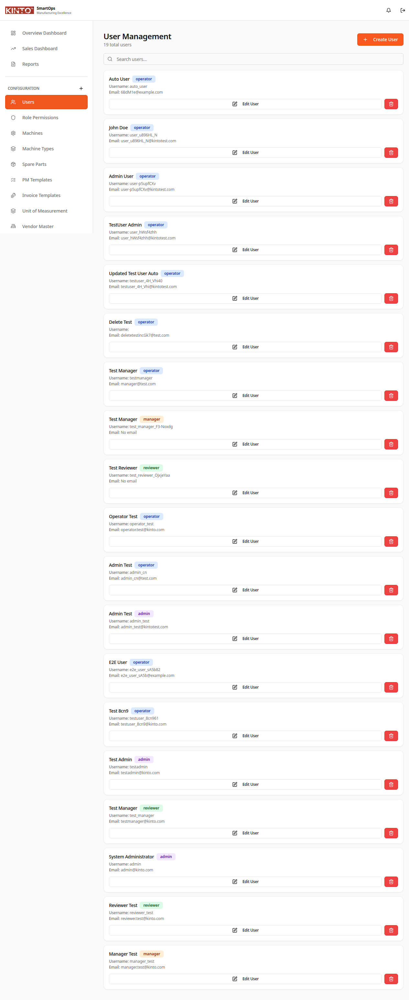

---

## 8.5 Role Permissions

### What is this?
Control which features each user role can access.

### Screenshot
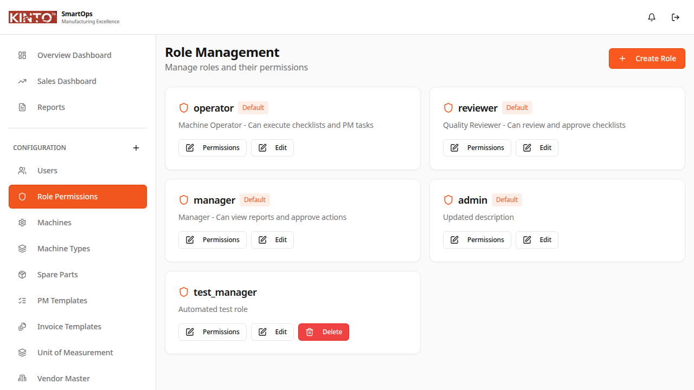

---

# 9. Quality Checklists

## 9.1 Preventive Maintenance

### What is this?
Schedule and track maintenance activities for machines and equipment.

### Screenshot
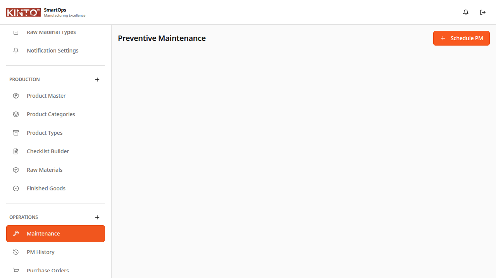

---

## 9.2 Reviewer Dashboard

### What is this?
Dashboard for reviewers to see pending approvals and completed checklists.

### Screenshot
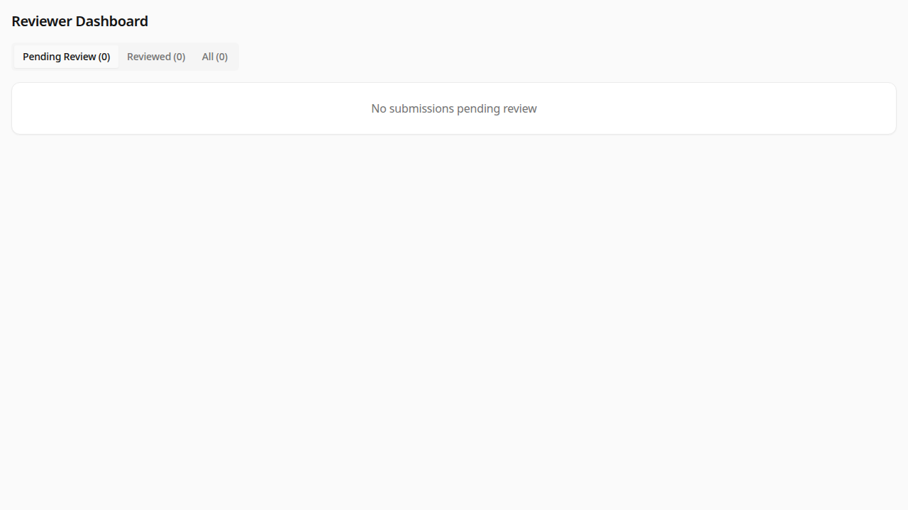

---

# 10. Document Storage

## 10.1 Notification Settings

### What is this?
Configure how and when the system sends notifications.

### Screenshot
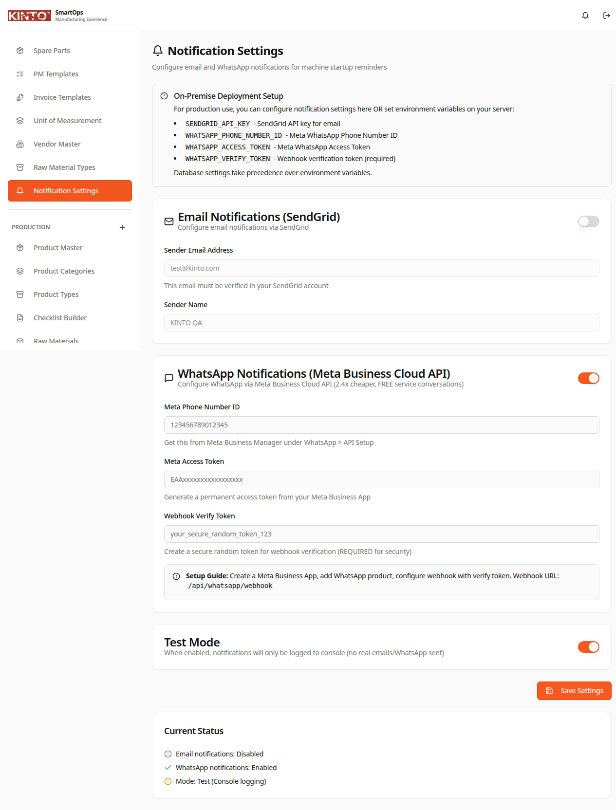

---

# 11. Reports

## 11.1 Available Reports

| Report | Purpose | Location |
|--------|---------|----------|
| **Sales Summary** | Daily/Monthly sales totals | Reports Hub |
| **GST Report (GSTR-1)** | Data for GST filing | Reports Hub |
| **Outstanding Report** | All pending payments | Pending Payments |
| **Cancelled Invoices** | Audit trail of cancellations | Cancelled Invoices |
| **Write-Off Report** | Written off amounts | Write-Off Report |
| **Production Variance** | Material usage analysis | Production Reports |
| **Cash Register Report** | Daily cash flow history | Cash Register Report |
| **Vendor History** | Individual customer ledgers | Vendor History |

---

# Quick Reference Cards

## Daily Operations Checklist

### Morning (Start of Day)
- [ ] Open Cash Register (enter opening balance)
- [ ] Check Machine Startup Checklists completed
- [ ] Review pending dispatches for today
- [ ] Check any overdue payments

### During Day
- [ ] Create invoices for orders
- [ ] Create gatepasses for dispatches
- [ ] Record payments received
- [ ] Process any returns

### Evening (End of Day)
- [ ] Complete production reconciliation
- [ ] Reconcile cash register
- [ ] Review next day's pending items
- [ ] Close cash register

---

## Invoice Correction Decision Chart

```
                   NEED TO CORRECT INVOICE?
                            │
                   Which month?
                     /          \
              THIS MONTH      LAST MONTH
                 │                │
         Has Gatepass?      What change?
          /       \           /      \
        NO        YES     REDUCE   INCREASE
         │         │         │         │
    CANCEL &   CREDIT     CREDIT    DEBIT
    REISSUE     NOTE       NOTE      NOTE
```

---

## GST Quick Reference

| Transaction Type | Tax Applicable |
|------------------|----------------|
| Same State Sale | CGST + SGST |
| Different State Sale | IGST |
| Export | Zero rated |
| SEZ Supply | Zero rated |

| Common HSN Codes | Products |
|------------------|----------|
| 3920 | Plastic films |
| 4811 | Coated paper |
| 3824 | Chemical preparations |

---

## Support Information

**For System Issues:**
- Contact your system administrator
- Check this documentation
- Report bugs with screenshots

**For Business Process Questions:**
- Consult your manager
- Refer to company SOPs
- Check GST portal for tax rules

---

*Document prepared for KINTO Smart Ops - Inmoisure Private Limited*
*Last Updated: November 2024*
