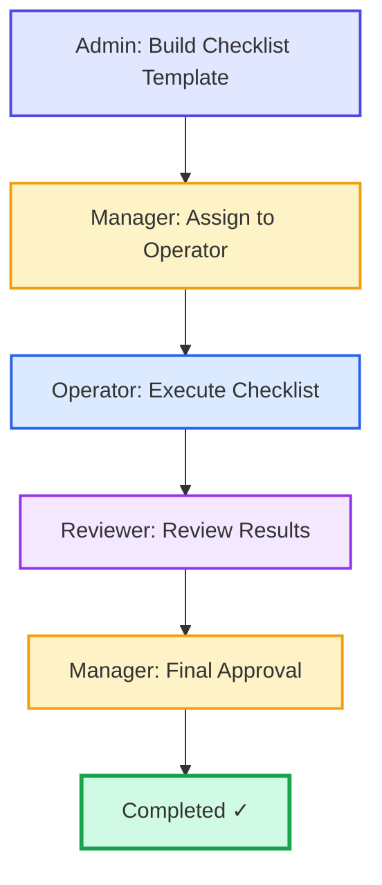
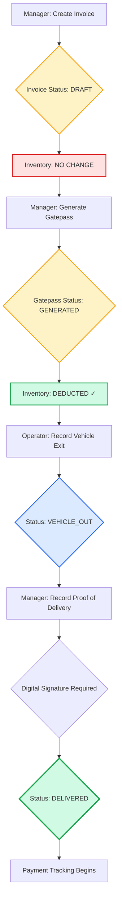
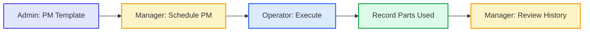

# 📊 KINTO Operations - Visual Workflow Diagrams

**Visual Reference for All 15 Workflows**

---

## 🎯 Workflow 1: QA Checklist - Complete Flow



### **Step-by-Step Flow**

```
┌─────────────────────────────────────────────────────────────┐
│                    WORKFLOW 1: QA CHECKLIST                 │
└─────────────────────────────────────────────────────────────┘

STEP 1: Admin Builds Template
├─ Create template: "Daily Quality Inspection"
├─ Add 5 checklist items (oil, temp, pressure, etc.)
├─ Set machine type
└─ Status: Template Ready

                         ↓

STEP 2: Manager Assigns Checklist
├─ Select template
├─ Assign to: operator_test
├─ Machine: Hydraulic Press 01
├─ Due date: Today 6:00 PM
└─ Status: Assigned → Notification sent to operator

                         ↓

STEP 3: Operator Executes Checklist
├─ Login → See assigned checklist
├─ Fill 5 items (Yes/No, Temperature, etc.)
├─ Add remarks: "All parameters normal"
├─ Submit for review
└─ Status: Submitted → Notification sent to reviewer

                         ↓

STEP 4: Reviewer Reviews
├─ Login → See submitted checklist
├─ Verify all 5 items
├─ Check: Temperature in range (65°C ✓)
├─ Approve/Reject
└─ Status: Reviewed → Notification sent to manager

                         ↓

STEP 5: Manager Final Approval
├─ Login → See reviewed checklist
├─ Final verification
├─ Approve for compliance
└─ Status: Completed ✓

```

---

## 🚚 Workflow 5: Sales & Dispatch - 5 Stage Flow (CRITICAL)



### **Complete 5-Stage Breakdown**

```
┌──────────────────────────────────────────────────────────────────┐
│           WORKFLOW 5: SALES & DISPATCH (5 STAGES)                │
│                 ⚠️ CRITICAL BUSINESS LOGIC ⚠️                     │
└──────────────────────────────────────────────────────────────────┘

╔════════════════════════════════════════════════════════════════╗
║ STAGE 1: INVOICE CREATION                                       ║
╚════════════════════════════════════════════════════════════════╝
Actor: Manager
Action: Create Sales Invoice
├─ Customer: XYZ Industries
├─ Items: 10 units Hydraulic Cylinder @ ₹5,000
├─ Total: ₹59,000 (incl GST)
└─ Status: DRAFT

⚠️ INVENTORY: NO CHANGE (still 75 units)
   Invoice = Sales Document ONLY

                         ↓

╔════════════════════════════════════════════════════════════════╗
║ STAGE 2: GATEPASS GENERATION (Warehouse Dispatch)              ║
╚════════════════════════════════════════════════════════════════╝
Actor: Manager
Action: Generate Gatepass from Invoice
├─ Items auto-populated from invoice ✓
├─ Vehicle: KA-01-AB-1234
├─ Driver: Suresh Kumar
├─ Cases: 2, Seals: SEAL-001, SEAL-002
└─ Status: GENERATED

✅ INVENTORY DEDUCTED: 75 → 65 units
   (Physical goods leaving warehouse)

Invoice Status: draft → READY_FOR_GATEPASS

                         ↓

╔════════════════════════════════════════════════════════════════╗
║ STAGE 3: VEHICLE EXIT (Security Gate)                          ║
╚════════════════════════════════════════════════════════════════╝
Actor: Operator (Security)
Action: Record Vehicle Exit
├─ Verify: Vehicle number matches
├─ Verify: Seal numbers intact
├─ Verify: Cases count correct
├─ Record: Exit timestamp
└─ Status: VEHICLE_OUT

Invoice Status: ready_for_gatepass → DISPATCHED

                         ↓

╔════════════════════════════════════════════════════════════════╗
║ STAGE 4: PROOF OF DELIVERY (Customer Receipt)                  ║
╚════════════════════════════════════════════════════════════════╝
Actor: Manager/Operator
Action: Record POD with Digital Signature
├─ Received by: Ramesh Kumar (customer)
├─ Cases delivered: 2 (all)
├─ Seals status: Intact ✓
├─ 📝 Digital Signature: [Canvas signature capture]
└─ Status: DELIVERED

✅ Signature Validation:
   - Format: base64 image
   - Min length: 100 chars
   - Content verification ✓

Invoice Status: dispatched → DELIVERED (FINAL)

                         ↓

╔════════════════════════════════════════════════════════════════╗
║ STAGE 5: PAYMENT TRACKING                                      ║
╚════════════════════════════════════════════════════════════════╝
System: Automatic
├─ Invoice marked: Delivered
├─ Payment due: 30 days from invoice date
├─ Outstanding: ₹59,000
└─ Payment reminders scheduled

🔔 Reminders sent at: 1, 7, 15, 30 days overdue


═══════════════════════════════════════════════════════════════
               KEY BUSINESS RULE (CRITICAL!)
═══════════════════════════════════════════════════════════════

📦 INVENTORY DEDUCTION LOGIC:

  ❌ WRONG: Deduct at Invoice creation
     (Invoice = just a sales document)

  ✅ CORRECT: Deduct at Gatepass creation
     (Gatepass = physical goods leaving warehouse)

═══════════════════════════════════════════════════════════════
```

---

## 📦 Workflow 4: Inventory Management - Complete Cycle

```
┌──────────────────────────────────────────────────────────────┐
│               WORKFLOW 4: INVENTORY FLOW                     │
└──────────────────────────────────────────────────────────────┘

PHASE 1: Purchase & Receive
├─ Vendor: ABC Steel Suppliers
├─ Material: Steel Plate 5mm
├─ Quantity: 1000 kg
└─ Inventory: 0 → 1000 kg

                    ↓

PHASE 2: Issue to Production
├─ Work Order: WO-2025-001
├─ Issue Quantity: 100 kg
├─ Purpose: "Manufacturing hydraulic cylinders"
└─ Inventory: 1000 kg → 900 kg

                    ↓

PHASE 3: Production Recording
├─ Product: Hydraulic Cylinder HC-500
├─ Quantity Produced: 25 units
├─ Raw Material Consumed: 100 kg steel
└─ Finished Goods Inventory: 0 → 25 units

                    ↓

PHASE 4: Sales (Invoice Creation)
├─ Invoice: INV-2025-001
├─ Quantity: 10 units
├─ Status: Draft
└─ Inventory: NO CHANGE (still 25 units)

                    ↓

PHASE 5: Dispatch (Gatepass Creation)
├─ Gatepass: GP-2025-001
├─ Quantity: 10 units
├─ Status: Generated
└─ Inventory: 25 → 15 units ✓ DEDUCTED

                    ↓

PHASE 6: Low Stock Alert
├─ Current: 15 units
├─ Minimum: 10 units
├─ Reorder Level: 20 units
└─ Alert: Triggered to Manager

                    ↓

PHASE 7: Replenishment
├─ Create PO for raw materials
├─ Receive stock
├─ Produce more units
└─ Cycle repeats
```

---

## 💰 Workflow 9: Payment FIFO Allocation

```
┌──────────────────────────────────────────────────────────────┐
│          WORKFLOW 9: PAYMENT FIFO ALLOCATION                 │
└──────────────────────────────────────────────────────────────┘

CUSTOMER: XYZ Industries

OUTSTANDING INVOICES (Chronological Order):
┌─────────────────────────────────────────────────────────────┐
│ Invoice #        │ Date    │ Amount    │ Status            │
├──────────────────┼─────────┼───────────┼───────────────────┤
│ INV-2025-001     │ Jan 15  │ ₹29,000   │ Partial (₹0 paid)│
│ INV-2025-002     │ Jan 20  │ ₹45,000   │ Unpaid           │
│ INV-2025-003     │ Jan 25  │ ₹60,000   │ Unpaid           │
├──────────────────┴─────────┴───────────┴───────────────────┤
│ TOTAL OUTSTANDING:           ₹1,34,000                      │
└─────────────────────────────────────────────────────────────┘

                         ↓
              CUSTOMER PAYS: ₹50,000
                         ↓

SYSTEM APPLIES FIFO (First In, First Out):

Step 1: Apply to OLDEST invoice (INV-2025-001)
├─ Invoice: INV-2025-001 (Jan 15)
├─ Due: ₹29,000
├─ Apply: ₹29,000 ✓ FULLY PAID
└─ Remaining payment: ₹50,000 - ₹29,000 = ₹21,000

                         ↓

Step 2: Apply to NEXT oldest (INV-2025-002)
├─ Invoice: INV-2025-002 (Jan 20)
├─ Due: ₹45,000
├─ Apply: ₹21,000 (partial)
└─ Remaining: ₹0 (payment exhausted)

                         ↓

FINAL STATE:
┌─────────────────────────────────────────────────────────────┐
│ Invoice #        │ Date    │ Paid      │ Due       │ Status│
├──────────────────┼─────────┼───────────┼───────────┼───────┤
│ INV-2025-001     │ Jan 15  │ ₹29,000   │ ₹0        │ PAID ✓│
│ INV-2025-002     │ Jan 20  │ ₹21,000   │ ₹24,000   │ PART  │
│ INV-2025-003     │ Jan 25  │ ₹0        │ ₹60,000   │ UNPAID│
├──────────────────┴─────────┴───────────┴───────────┴───────┤
│ TOTAL OUTSTANDING:                      ₹84,000            │
└─────────────────────────────────────────────────────────────┘
```

---

## 🔧 Workflow 2: Preventive Maintenance



### **PM Execution Flow**

```
┌──────────────────────────────────────────────────────────────┐
│            PREVENTIVE MAINTENANCE WORKFLOW                   │
└──────────────────────────────────────────────────────────────┘

CREATE TEMPLATE (Admin)
├─ Template: "Monthly Hydraulic System Check"
├─ Machine Type: Hydraulic Press
├─ Frequency: 30 days
├─ Tasks: 6 tasks
│   1. Check hydraulic fluid level
│   2. Inspect hoses for cracks
│   3. Test pressure gauge
│   4. Lubricate moving parts
│   5. Clean filters
│   6. Check for unusual noises
└─ Required Parts:
    - Hydraulic Fluid (2L)
    - Filter Cartridge (1 unit)

                    ↓

SCHEDULE PM (Manager)
├─ Template: Monthly Hydraulic Check
├─ Machine: Hydraulic Press 01
├─ Scheduled: Tomorrow
├─ Assigned to: operator_test
└─ Notification: Sent to operator

                    ↓

EXECUTE PM (Operator)
├─ Start PM → Timer begins
├─ Complete 6 tasks (check, inspect, test, etc.)
├─ Record spare parts used:
│   - Hydraulic Fluid: 2L (auto-deducts from inventory)
│   - Filter Cartridge: 1 unit
├─ Duration: 1.5 hours (vs estimated 2 hours)
├─ Notes: "All tasks completed. System running smoothly."
└─ Submit → Status: Completed

                    ↓

REVIEW HISTORY (Manager)
├─ View completed PM
├─ Tasks: 6/6 complete ✓
├─ Parts used: 2L fluid, 1 filter
├─ Time: 1.5 hrs (efficient!)
└─ Print report for compliance
```

---

## 🚀 Workflow 3: Machine Startup Reminder

```
┌──────────────────────────────────────────────────────────────┐
│          MACHINE STARTUP REMINDER WORKFLOW                   │
└──────────────────────────────────────────────────────────────┘

CONFIGURE STARTUP (Admin)
├─ Machine: CNC Machine 001
├─ Startup Tasks: 5 tasks
│   1. Power on main switch
│   2. Check coolant level
│   3. Initialize control system
│   4. Home all axes
│   5. Warm-up cycle (10 mins)
├─ Reminder: 2 hours before production
└─ Channels: WhatsApp + Email

                    ↓

SCHEDULE PRODUCTION (Manager)
├─ Machine: CNC Machine 001
├─ Start Time: Tomorrow 10:00 AM
├─ Operator: operator_test
└─ System calculates reminder: Tomorrow 8:00 AM

                    ↓

SEND REMINDER (System - Automatic)
├─ Time: Tomorrow 8:00 AM
├─ WhatsApp to Operator: "Startup reminder: CNC Machine 001"
├─ Email to Operator
└─ In-app notification

                    ↓

COMPLETE STARTUP (Operator)
├─ Login at 8:00 AM
├─ See alert: "Startup due for CNC Machine 001"
├─ Complete 5 tasks:
│   ✓ Power on
│   ✓ Coolant check
│   ✓ Initialize system
│   ✓ Home axes
│   ✓ Warm-up (10 mins)
├─ Confirm: "Machine Ready"
└─ Manager notified: "CNC Machine 001 ready for 10:00 AM"

                    ↓

OVERDUE SCENARIO (If missed)
├─ Time: 9:00 AM (1 hour overdue)
├─ Escalation:
│   - WhatsApp to Operator: "URGENT: Startup overdue"
│   - WhatsApp to Manager: "Alert: Operator not started (1 hr late)"
│   - Email to Manager
└─ Production delay prevented
```

---

## 📊 Workflow 7: GST Reporting

```
┌──────────────────────────────────────────────────────────────┐
│                   GST REPORTING WORKFLOW                     │
└──────────────────────────────────────────────────────────────┘

INVOICE DATA IN SYSTEM:
┌───────────────────────────────────────────────────────────┐
│ Month: January 2025                                        │
├───────────────────────────────────────────────────────────┤
│ B2B Invoices (with customer GSTIN):      8 invoices       │
│ B2C Invoices (no GSTIN):                 2 invoices       │
│ Total Tax Collected:                     ₹53,100          │
│ HSN Codes:                               5 codes          │
└───────────────────────────────────────────────────────────┘

                    ↓

GENERATE GSTR-1 REPORT (Admin)
├─ Navigate to: Reports → GST Reports
├─ Select: GSTR-1
├─ Period: January 2025
├─ Click: "Generate Report"
└─ Report shows:
    ┌─────────────────────────────────────────────────┐
    │ SECTION 1: B2B Invoices                         │
    ├─────────────────────────────────────────────────┤
    │ Customer GSTIN │ Invoice # │ Amount │ Tax      │
    │ 29XYZAB5678... │ INV-001   │ 59000  │ 9000     │
    │ 29ABCDE1234... │ INV-002   │ 45000  │ 7200     │
    │ ... (8 invoices)                                │
    ├─────────────────────────────────────────────────┤
    │ SECTION 2: B2C Invoices (Aggregated)            │
    ├─────────────────────────────────────────────────┤
    │ Total B2C Sales │ Amount    │ Tax              │
    │ 2 invoices      │ 25000     │ 4000             │
    ├─────────────────────────────────────────────────┤
    │ SECTION 3: HSN Summary                          │
    ├─────────────────────────────────────────────────┤
    │ HSN Code │ Qty │ Value  │ CGST │ SGST │ IGST  │
    │ 84122100 │ 100 │ 500000 │ 9%   │ 9%   │ -     │
    │ ... (5 HSN codes)                               │
    ├─────────────────────────────────────────────────┤
    │ TOTAL TAX COLLECTED:          ₹53,100           │
    └─────────────────────────────────────────────────┘

                    ↓

EXPORT TO EXCEL (Admin)
├─ Click: "Export to Excel"
├─ File downloads: GSTR1_Jan2025.xlsx
├─ Format: GSTIN portal compatible
└─ Ready for government filing ✓

                    ↓

GSTR-3B GENERATION (Monthly Return)
├─ Auto-calculates from GSTR-1 data
├─ Output Tax: ₹53,100
├─ Input Tax Credit: ₹XX,XXX
├─ Net Tax Payable: ₹XX,XXX
└─ Export for filing
```

---

## 🔔 Workflow 13: System Alerts

```
┌──────────────────────────────────────────────────────────────┐
│                    SYSTEM ALERTS WORKFLOW                    │
└──────────────────────────────────────────────────────────────┘

ALERT TYPE 1: Low Stock Alert
───────────────────────────────────
Trigger: Material issued, stock below reorder level
├─ Material: Steel Plate 5mm
├─ Current: 250 kg → 150 kg (after issuance)
├─ Reorder Level: 300 kg
└─ Alert: TRIGGERED

Notification:
├─ WhatsApp to Manager: "LOW STOCK: Steel Plate 5mm"
├─ Email to Admin
└─ Dashboard: Red badge

Manager Action:
├─ See alert on dashboard
├─ Click: "Create PO"
├─ System pre-fills: Material, suggested quantity
└─ Submit PO → Stock replenishment initiated


ALERT TYPE 2: PM Overdue
───────────────────────────────────
Trigger: PM scheduled but not executed by due date
├─ PM: "Monthly Hydraulic Check"
├─ Due: Jan 15, 2025
├─ Current: Jan 16, 2025 (1 day overdue)
└─ Alert: TRIGGERED

Notification:
├─ WhatsApp to Operator: "OVERDUE: Monthly PM"
├─ Email to Manager: "PM 1 day overdue"
└─ Dashboard: Red "Overdue" badge

Operator Action:
├─ See alert
├─ Execute PM immediately
└─ Alert resolved


ALERT TYPE 3: Payment Overdue
───────────────────────────────────
Trigger: Invoice past due date
├─ Invoice: INV-2025-001
├─ Due: Jan 31, 2025
├─ Current: Feb 1, 2025 (1 day overdue)
└─ Alert: TRIGGERED

Escalation Schedule:
├─ Day 1: Email to Manager
├─ Day 7: WhatsApp: "URGENT: 7 days overdue"
├─ Day 15: Escalate to Admin
└─ Day 30: Legal notice preparation


ALERT TYPE 4: Checklist Missed
───────────────────────────────────
Trigger: Checklist not started by due time
├─ Checklist: "Daily Quality Inspection"
├─ Due: Today 6:00 PM
├─ Current: Today 6:30 PM (30 mins overdue)
└─ Alert: TRIGGERED

Notification:
├─ WhatsApp to Operator: "OVERDUE: Daily Inspection"
├─ WhatsApp to Reviewer: "Operator 30 mins late"
├─ Email to Manager: "Escalation: Missed checklist"
└─ All stakeholders notified within 30 mins
```

---

## 🎯 Workflow 15: End-to-End Integration Test

```
┌──────────────────────────────────────────────────────────────┐
│     COMPLETE MANUFACTURING CYCLE (E2E INTEGRATION TEST)      │
│              FROM RAW MATERIAL TO DELIVERY                   │
└──────────────────────────────────────────────────────────────┘

PHASE 1: SETUP (Admin)
══════════════════════════════════════════════════════════════
├─ Create product: Widget A
├─ Create raw material: Steel Plate 5mm
├─ Create checklist template
├─ Create invoice template
├─ Create vendor: Steel supplier
└─ Configure system settings

PHASE 2: PROCUREMENT (Manager)
══════════════════════════════════════════════════════════════
├─ Create PO: 1000 kg steel from vendor
├─ Receive: 1000 kg into inventory
└─ Inventory: 0 → 1000 kg ✓

PHASE 3: QUALITY SETUP (Manager + Operator + Reviewer)
══════════════════════════════════════════════════════════════
├─ Manager assigns checklist to operator
├─ Operator executes quality checks
├─ Reviewer reviews results
├─ Manager approves
└─ Quality verified ✓

PHASE 4: PRODUCTION (Manager + Operator)
══════════════════════════════════════════════════════════════
├─ Manager issues raw material: 100 kg steel
├─ Inventory: 1000 kg → 900 kg
├─ Operator records production: 50 units Widget A
├─ Finished goods inventory: 0 → 50 units
└─ Production complete ✓

PHASE 5: SALES (Manager)
══════════════════════════════════════════════════════════════
├─ Create invoice: 50 units to XYZ Industries
├─ Invoice amount: ₹2,50,000
├─ Status: Draft
└─ Inventory: NO CHANGE (still 50 units)

PHASE 6: DISPATCH (Manager + Operator)
══════════════════════════════════════════════════════════════
├─ Manager generates gatepass from invoice
├─ Inventory DEDUCTED: 50 → 0 units ✓
├─ Operator records vehicle exit (security gate)
├─ Manager records POD with digital signature
├─ Status: Delivered
└─ Dispatch complete ✓

PHASE 7: PAYMENT (Manager)
══════════════════════════════════════════════════════════════
├─ Customer pays partial: ₹1,50,000
├─ System applies FIFO allocation
├─ Outstanding: ₹1,00,000
├─ Payment reminder scheduled
└─ Payment tracking active ✓

PHASE 8: REPORTING (Admin + Manager)
══════════════════════════════════════════════════════════════
├─ Generate GST report (includes this invoice)
├─ View sales dashboard (revenue updated)
├─ Export payment register
├─ Print compliance reports
└─ Reporting complete ✓

══════════════════════════════════════════════════════════════
                        E2E COMPLETE ✓
══════════════════════════════════════════════════════════════
VALIDATION CHECKPOINTS:
├─ Raw material: 1000 kg purchased → 100 kg issued → 900 kg remaining ✓
├─ Finished goods: 50 units produced → 50 dispatched → 0 remaining ✓
├─ Invoice: Created → Dispatched → Delivered → Payment tracking ✓
├─ Quality: Checklist completed with all approvals ✓
├─ Compliance: All reports generated ✓
└─ Audit trail: Complete history maintained ✓
```

---

**Visual Workflow Diagrams v1.0**  
*Use these diagrams alongside detailed test guide for quick reference*
